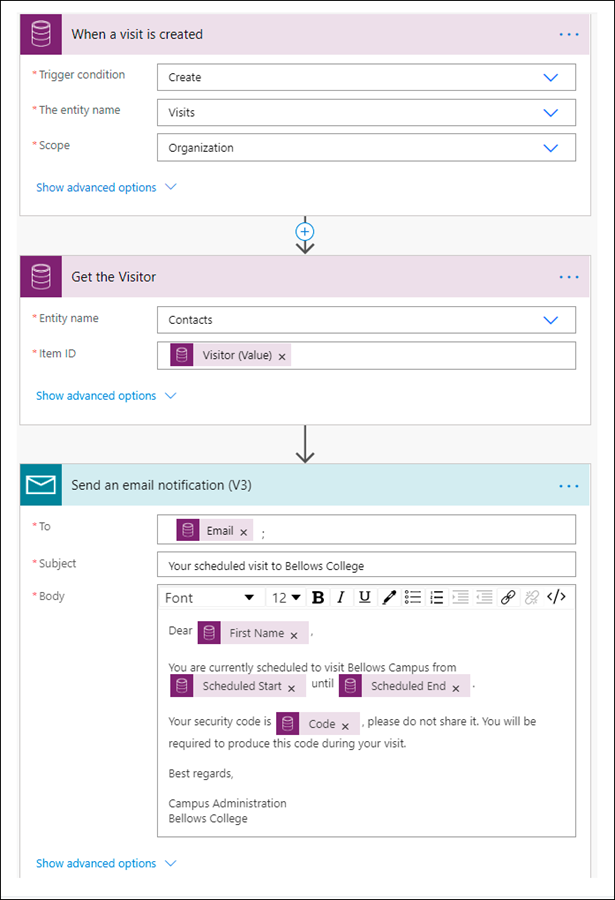
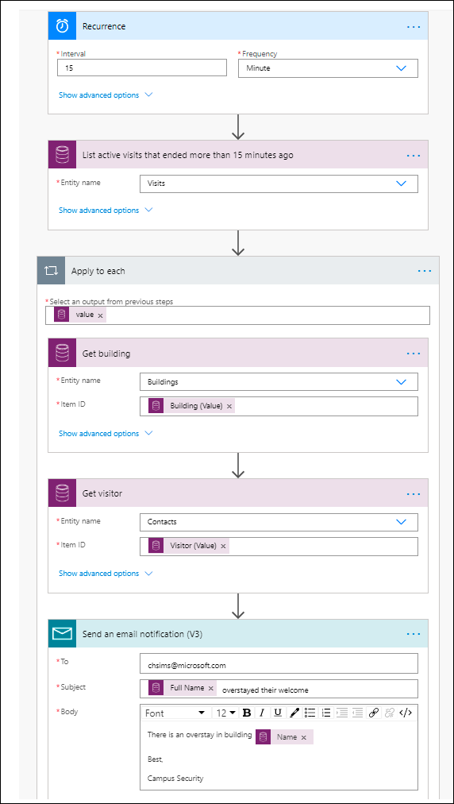

# Module 4: Get Started with Power Automate
## Lab: How to build an automated solution

## Scenario

Bellows College is an educational organization with multiple buildings on campus. Campus visitors are currently recorded in paper journals. The information is not captured consistently, and there are no means to collect and analyze data about the visits across the entire campus. 

Campus administration would like to modernize their visitor registration system where access to the buildings is controlled by security personnel and all visits are required to be pre-registered and recorded by their hosts.

Throughout this course, you will build applications and perform automation to enable the Bellows College administration and security personnel to manage and control access to the buildings on campus. 

In this lab, you will create Power Automate flows to automate various parts of the campus management. 

# High-level lab steps

The following have been identified as requirements you must implement to complete the project:

* The unique code assigned to each visitor must be made available to them prior to their visit.
* Security personnel need to receive notifications of visitors overstaying their scheduled timeslots.

## Prerequisites

* Completion of **Module 0 Lab 0 - Validate lab environment**
* Completion of **Module 2 Lab 1 - Introduction to Common Data Service**
* Campus Staff app created in **Module 3 Lab 2 – How to build a canvas app, part 2** (for testing)
* John Doe contact created with a personal email address in **Module 3 Lab 4 - How to build a model-driven app** (for testing)

## Things to consider before you begin

-   What is the most appropriate distribution mechanism for the visitor codes?
-   How could overstays be measured and strict policies enforced?

# Exercise \#1: Create Visit Notification flow

**Objective:** In this exercise, you will create a Power Automate flow that implements the requirement. The visitor should be sent an email that includes the unique code assigned to the visit.

## Task \#1: Create flow

1.  Open your Campus Management solution.

    -   Sign in to <https://make.powerapps.com>

    -   Select your **environment.**

    -   Select **Solutions**.

    -   Click to open your **Campus Management** solution.

2.  Click **New** and select **Cloud flow**. This will open the Power Automate flow editor in a new window.

3. Search for *Current* and select **Common Data Service (Current Environment)** connector.

4. Select the trigger **When a Row is Added, Modified or Deleted**.

   * Select **Create** for **Change Type**
   
   * Select **Visits** for **Table name**
   
   * Select **Organization** for **Scope**
   
   * On the trigger step, click the ellipsis (**...**) and click **Rename**. Rename this trigger **"When a visit is created"**. This is a good practice, so you and other flow editors can understand the purpose of the step without having to dive into the details.

5.  Click **New Step**. This step is required to retrieve visitors information, including email address.

6. Search for *Current* and select **Common Data Service (Current Environment)** connector.

7. Select **Get a row by ID** action. 

   * Select **Contacts** as **Table name**
   
   * In the **Row ID** field, select **Visitor (Value)** from the Dynamic content list.
   
   * On this action, click the ellipsis (**...**) and click **Rename**. Rename this action **"Get the Visitor"**. This is a good practice, so you and other flow editors can understand the purpose of the step without having to dive into the details.

8. Click **New Step**. This is the step that will create and send email to the visitor.

9. Search for *mail*, select **Mail** connector and **Send an email notification(V3)** action 

   * If asked to Accept terms and conditions for using this action, click **Accept**.
   
   * Select **To** field, select **Email** from the Dynamic content list. Notice that it is beneath the **Get the Visitor** header. This means you are selecting the Email that is related to the Visitor that you looked up in the previous step. 

   * Enter **Your scheduled visit to Bellows College** in the **Subject** field.

   * Enter the following text in **Email Body**:  
        
        > Dynamic content needs to be placed where fields are named in brackets. It is recommended to copy & paste all text first and then add dynamic content in the correct places.
   
        ```
        Dear {First Name},

        You are currently scheduled to visit Bellows Campus from {Scheduled Start} until {Scheduled End}.

        Your security code is {Code}, please do not share it. You will be required to produce this code during your visit.

        Best regards,

        Campus Administration
        Bellows College
        ```
   
10.  Select the **Untitled** flow name at the top and rename it to `Visit notification`

11. Press **Save**

    Leave this flow tab open for the next task. You flow should look approximately like the following:



## Task \#2: Validate and test the flow

1.  Open a new tab in your browser and navigate to <https://make.powerapps.com>

2.  Click **Apps** and select the **Campus Staff** app you created

3.  Leaving this tab open, navigate back to the previous tab with your flow. 

4.  On the command bar, click **Test**. Select **Manually** under Test Flow and then **Save & Test**.

5.  Leaving the flow tab open, navigate back to the previous tab with the **Campus Staff** app.

6.  Press **+** to add a new Visit record

7.  Enter **John Doe** as **Name** and choose any **Building**

8.  Choose **John Doe** as the **Visitor**

9.  Choose the **Scheduled Start** and **Scheduled End Dates** to any dates in the future.

10.  Press the **Checkmark** icon to save the new visit

11.  Navigate back to the previous tab with the flow being tested. Watch as the flow is run. If there are any errors, go back and compare your flow to the example above. If the email is sent successfully, you will receive it in your inbox. 

12.  Click the back arrow on the command bar

13.  In the **Details** section, notice that the **Status** is set to **On**. This means your flow will run whenever a new Visit is created, until you turn it off. Any time the flow runs, you will see it added to the **28-day run history** list.

14.  Turn the flow off by clicking **Turn off** on the command bar. You may need to press the ellipses (**...**) to see this option.

15.  Close this window.

# Exercise #2: Create Security Sweep flow

**Objective:** In this exercise, you will create a Power Automate flow that implements the requirement. A security sweep needs to be performed every 15 minutes, and security should be notified if any of the visitors overstayed their scheduled time.

## Task #1: Create flow to retrieve records

1. Open your Campus Management solution.

   -   Sign in to <https://make.powerapps.com>

   -   Select your **Environment.**

   -   Select **Solutions**.

   -   Click to open your **Campus Management** solution.

2. Click **New** and select **Cloud flow**. This will open the Power Automate flow editor in a new window.

3. Search for *recurrence*, select **Schedule** connector, and then select the **Recurrence** trigger.

4. Set **Interval** to **15 minutes**

5. Click **New step**. Search for *Current* and select **Common Data Service (Current Environment)** connector. Select **List rows** action.

   * Enter **Visits** as **Table name**
   
   * Click **Show advanced options**

   * Enter the following expression as **Filter Query**

   ```
     statecode eq 0 and bc_actualstart ne null and bc_actualend eq null and Microsoft.Dynamics.CRM.OlderThanXMinutes(PropertyName='bc_scheduledend',PropertyValue=15)
   ```
   
   * To break it down:
       * **statecode eq 0** filters active visits (where Status equal Active)
       * **bc_actualstart ne null** restricts search to visits where Actual Start has a value, i.e. there was a checkin
       * **bc_actualend eq null** restricts search to visits where there was no check out (Actual End has no value) 
       * **Microsoft.Dynamics.CRM.OlderThanXMinutes(PropertyName='bc_scheduledend',PropertyValue=15)** restricts visits where visits meant to complete more than 15 minutes ago.

   * On this action, click the ellipsis (**...**) and click **Rename**. Rename this action **"List active visits that ended more than 15 minutes ago"**. This is a good practice, so you and other flow editors can understand the purpose of the step without having to dive into the details.

6.  Click **New step**. Search for *Apply*, select **Apply to each** action 

7.  Select **value** from dynamics content in the **Select an output from previous steps** field. Notice that it is beneath the **List active visits that ended more than 15 minutes ago** gray header. This means you are selecting the list of visits that you looked up in the previous step. 

8.  Retrieve Building data for related record

    * Click **Add an action** inside the Apply to Each loop.
    
    * Search for *Current* and select **Common Data Service (Current Environment)** connector. 
    
    * Select **Get a row by ID** action.
    
    * Select **Buildings** as **Table name**
    
    * Select **Building (Value)** as **Row ID** from the Dynamic content
    
    * Click **...** beside **Get a row by ID**, select **Rename**. Enter **Get building** as step name
    
9.  Retrieve Visitor data for related record

    * Click **Add an action** inside the Apply to Each loop.
    
    * Search for *Current* and select **Common Data Service (Current Environment)** connector.
    
    * Select **Get a row by ID** action.
    
    * Select **Contacts** as **Table name**
    
    * Select **Visitor (Value)** as **Row ID** from the Dynamic content
    
    * Click **...** beside **Get a row by ID**, select **Rename**. Enter **Get visitor** as step name
    
11.  Send email notification

     * Click **Add an action** inside the Apply to Each loop. Add **Send an email notification(V3)** action from **Mail** connection.

12.  Enter your email address as **To**

13.  Enter the following in the **Subject** field. **Full Name** is a dynamic content from the **Get visitor** step.

     ```
     {Full Name} overstayed their welcome
     ```
   
14.  Enter the following in the **Body** field. **Name** is a dynamic content from **Get building** step.

     ```
     There is an overstay in building {Name}
         
     Best,
         
     Campus Security
     ```

15.  Select flow name **Untitled** in the upper left corner and rename it to **Security Sweep**

16.  Press **Save**

    Your flow should look approximately like the following:



## Task #2: Validate and test the flow

Your flow will begin sending you emails (to the email you specified when creating the John Doe contact previously) if there are visits that meet the requirements laid out in the flow.

1. Validate that you have visit records that:

   1. Have active status
   
   2. Scheduled End is in the past (by more than 15 minutes)
   
   3. Actual Start has a value.
   
   > **Note**: To view this data, navigate to make.powerapps.com in a new tab. Click Solutions on the left pane to locate your solution. Select the Visit entity, then select the Data tab. Click Active Visits in the top right-hand corner to display the view selector, then select All Columns.
   
2. Navigate to your solution and locate the **Security Sweep** flow. Click the **...** and click **Edit**.

3. When your flow opens, click **Test**.

4. Select **Manually** under Test Flow.

5. Click **Test** and **Run Flow**.

6. When flow competes, click **Done**. 

7. Expand **Apply to each**, then expand the **Send an email notification(V3)** step. Check the **Subject**, **Email Body** values.

8. Navigate to solution, click **...** next to the flow, select **Turn off**. This is to prevent flow from executing on a schedule on the test system.

# Challenges

* Add Actual Start and Scheduled End to the email body.
* How could you ensure user-friendly date formatting is used in the email body?
* Is it possible to generate a table with overstay information and send only a single email?
* Can you generate barcode for the visit code? When will that be useful?
